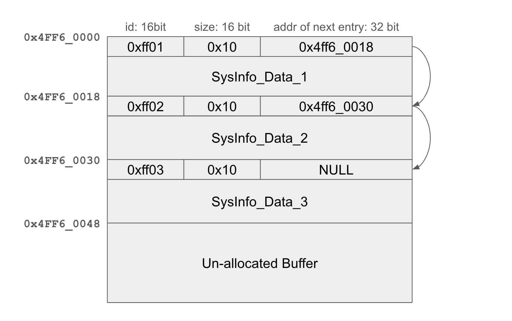

# Shared Memory & SysInfo

This document covers the concept of shared memory, why it is important and how to use SysInfo to manage shared memory in your applications.

## Overview

Shared memory refers to the memory region which is accessible by both maincore and subcore. In ESP-AMP, shared memory is the fundamental building block of cross-core communication and synchronization between maincore and subcore.

To centralize the management of shared memory, ESP-AMP introduces SysInfo to keep track of allocated shared memory blocks. Maincore can allocate a block of shared memory via SysInfo, initialize the content, and assign a unique id to this block. Subcore applications can get the content of shared memory blocks by querying SysInfo.

ESP-AMP provides two shared memory pools:

- HP RAM shared memory: general-purpose pool for cross-core communication.
- RTC RAM shared memory: only available when LP core is used as subcore; suitable for data that must be retained in RTC memory. Do not use this pool for objects requiring atomic operations.

## Design

### SysInfo Structure

SysInfo consists of a list of entries that keep track of each allocated memory block. Each entry is a triple with 16-bit ID, 16-bit size, and 32-bit address. The maximum number of entries can be configured via sdkconfig. The structure of SysInfo is shown below.



There is no API to free SysInfo in ESP-AMP. Once an entry of SysInfo is allocated, it will be kept in the system until the system is reset.

## Usage

SysInfo IDs are unsigned short integers range from `0x0000` to `0xffff`. The upper half (`0xff00` ~ `0xffff`) is reserved for ESP-AMP internal use. Lower half is free to use in user application.

By default, SysInfo supports up to 16 entries. At present, ESP-AMP internally takes 6 entries which are:

```
SYS_INFO_RESERVED_ID_SW_INTR,      /* reserved for software interrupt (HP) */
SYS_INFO_RESERVED_ID_EVENT_MAIN,   /* reserved for main core event (HP) */
SYS_INFO_RESERVED_ID_EVENT_SUB,    /* reserved for sub core event (HP) */
SYS_INFO_RESERVED_ID_VQUEUE,       /* store shared queue (packed virtqueue) data structure and buffer (HP) */
SYS_INFO_RESERVED_ID_SYSTEM,       /* reserved for system service (HP) */
SYS_INFO_RESERVED_ID_PM,           /* reserved for power management (RTC) */
```

When allocating or getting a SysInfo entry, specify which pool to use:

- `SYS_INFO_CAP_HP`: HP RAM shared memory
- `SYS_INFO_CAP_RTC`: RTC RAM shared memory (only available when LP core is used as subcore)

### Maincore

Maincore application can allocate a block of shared memory via SysInfo. The following code snippet shows how to allocate a block of shared memory and initialize the content to indicate a person's name and age.

```c
typedef struct {
    char name[16];
    uint32_t age;
} Person_t;

Person_t *person = (Person_t *) esp_amp_sys_info_alloc(SYS_INFO_ID_PERSON_1, sizeof(Person_t), SYS_INFO_CAP_HP);
if (person == NULL) {
    return -1;
}
```

### Subcore

Subcore application can get the content of shared memory blocks by querying SysInfo. The following code snippet shows how to get the content of a shared memory block set by maincore.

```c
typedef struct {
    char name[16];
    uint32_t age;
} Person_t;

Person_t *person = (Person_t *) esp_amp_sys_info_get(SYS_INFO_ID_PERSON_1, NULL, SYS_INFO_CAP_HP);
if (person == NULL) {
    return -1;
}

printf("Person name: %s\n", person->name);
printf("Person age: %d\n", person->age);
```

### Sdkconfig Options

- `CONFIG_ESP_AMP_HP_SHARED_MEM_SIZE`: Size of shared memory (from HP RAM) accessible by maincore and subcore.
  - ESP-AMP components internally allocate buffers from this shared memory, such as virtqueue buffers, event and software interrupt bits. Make sure the size is large enough. Application can also allocate buffers from this pool via SysInfo.
- `CONFIG_ESP_AMP_RTC_SHARED_MEM_SIZE` (when LP core is used as subcore): Size of RTC RAM shared memory reserved for SysInfo.
  - Use this for data that must be placed in RTC memory. Do not use it for objects requiring atomic operations (e.g., virtqueues, events), which should remain in HP RAM.
